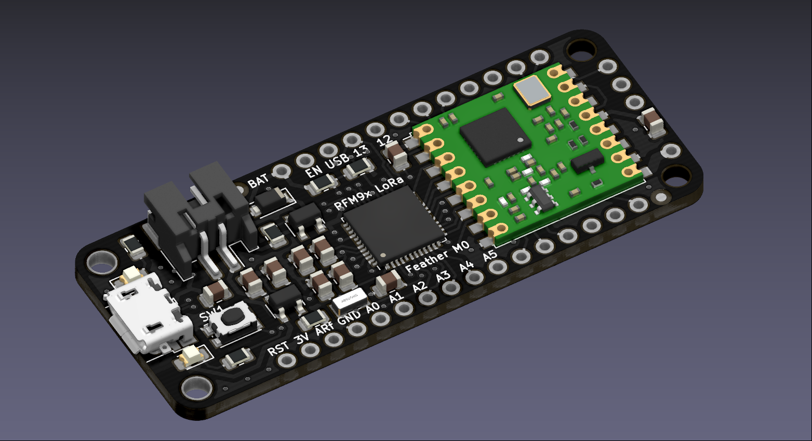
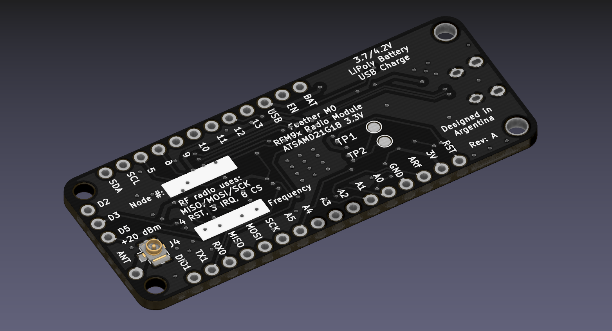
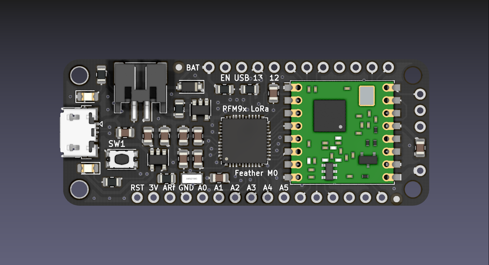
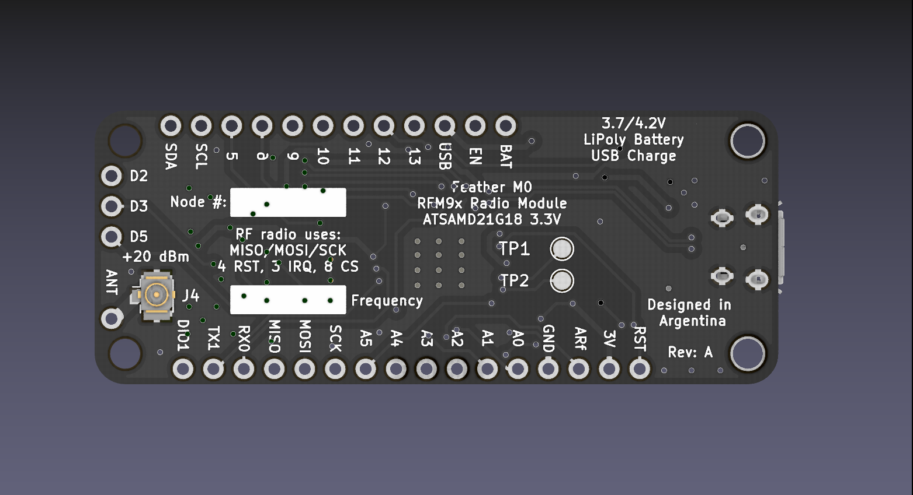

## Trabajo Práctico Final de la asignatura DCI ##

Este repositorio contiene el Trabajo Práctico Final de la asignatura de Diseño de Circuitos Impresos de la carrera Maestría en Internet de las Cosas (MIoT) de la FIUBA.

* **Autor**: Agustín Curcio Berardi
* **Revisor**: Gustavo Zocco
* **Docente**: Diego Brengui
* **Título del Trabajo**:  Adafruit Feather M0 with LoRa Radio Module Adaptation
* **Descripción**:  Plataforma modular Feather desarrollada por Adafruit con el mismo concepto de las placas Arduino. Existen diversas placas con un mismo formato físico y diferente hardware montado. Esta versión en particular incorpora un microcontrolador ARM Cortex-M0 junto con un módulo LoRa basado en el chipset SX1276 de la empresa Semtech.

     
    <b>Figura 1</b>. Vista isométrica superior de la adaptación realizada. 

     
    <b>Figura 2</b>. Vista isométrica inferior de la adaptación realizada. 

     
    <b>Figura 3</b>. Vista superior de la adaptación realizada. 

     
    <b>Figura 4</b>. Vista inferior de la adaptación realizada. 

## Detalles de la adaptación ##

Este Trabajo Práctico realizó una adaptación de la placa utilizada como propuesta para poder cumplir con los requerimientos establecidos en la materia. Así:

- Se modificaron los tamaños de los componentes pasivos. Se pasó de tamaño 0603 a 0805.
- El cambio de tamaño de los componentes pasivos requirió modificar las dimensiones del circuito impreso. La altura no se modificó para garantizar la compatibilidad con otras placas de la línea Feather. No obstante, sí se modificó el largo total de la misma para hacer lugar a componentes de mayor tamaño. El circuito impreso final es 6,223 mm más largo que el original.
- Se agregó un segundo fiducial que no estaba presente en el diseño original.
- Se adoptó HASL como terminación superficial en lugar de ENIG.

## Licencia de este trabajo ##
Designed by Limor Fried/Ladyada for Adafruit Industries. Creative Commons Attribution/Share-Alike. See License.txt for additional information.

## Estructura ##

El Trabajo Práctico Final tiene la siguiente estructura:

* doc: Toda la información sobre el circuito, principalmente de autoría o procesamiento propio.
  * Notas con cálculos.
  * Fotos de los prototipos.
* info: Toda la información recolectada, principalmente de terceros, como por ejemplo:
  * Hojas de datos.
  * Notas de aplicación.
  * Información de productos comerciales.
* pcb: Archivos de diseño esquemático y PCB.
  * Archivo esquemático en PDF.

