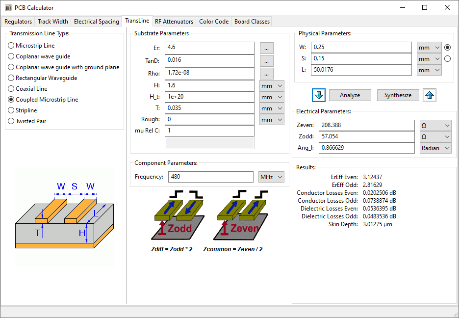
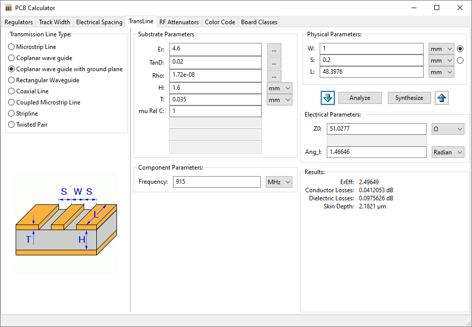

## Cálculos ##

Si bien no se encontraba dentro del alcance del Trabajo Práctico calcular líneas de impedancia controlada, se efectuaron dichos cálculos utilizando la calculadora de KiCad y los resultados obtenidos fueron aplicados en el circuito impreso. Se requirió calcular una línea diferencial para la conexión USB y una línea de transmisión para la conexión de antena. Los resultados de dichos cálculos se muestran en las Figuras 1 y 2.

     
    <b>Figura 1</b>. Cálculo de línea diferencial USB. 

     
    <b>Figura 2</b>. Cálculo de la línea de transmisión. 

