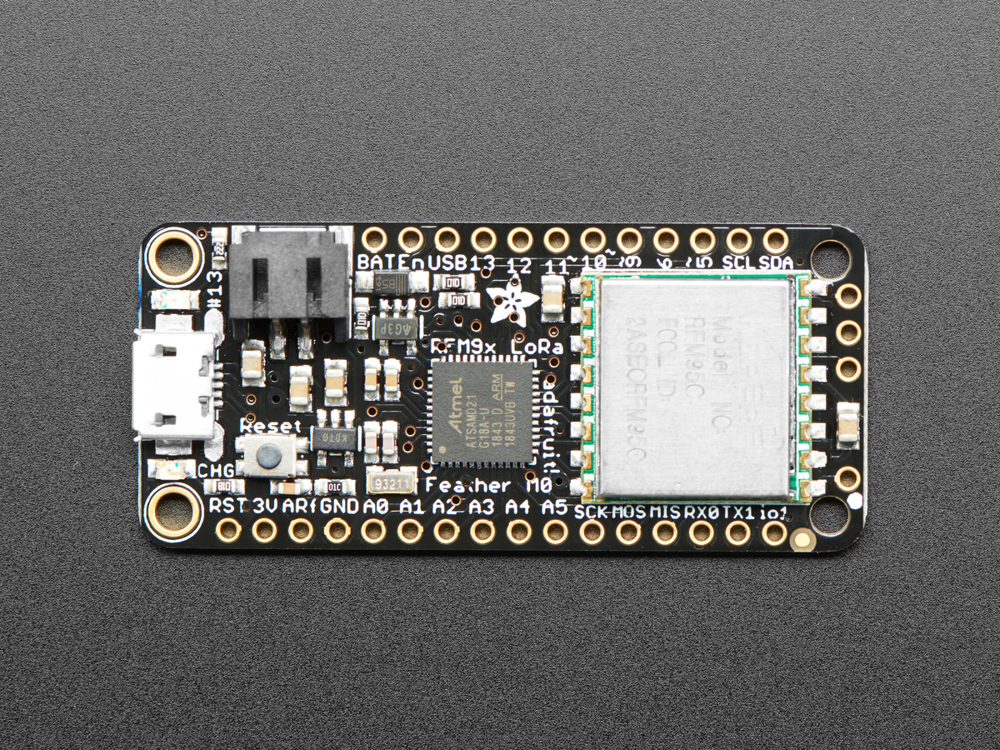
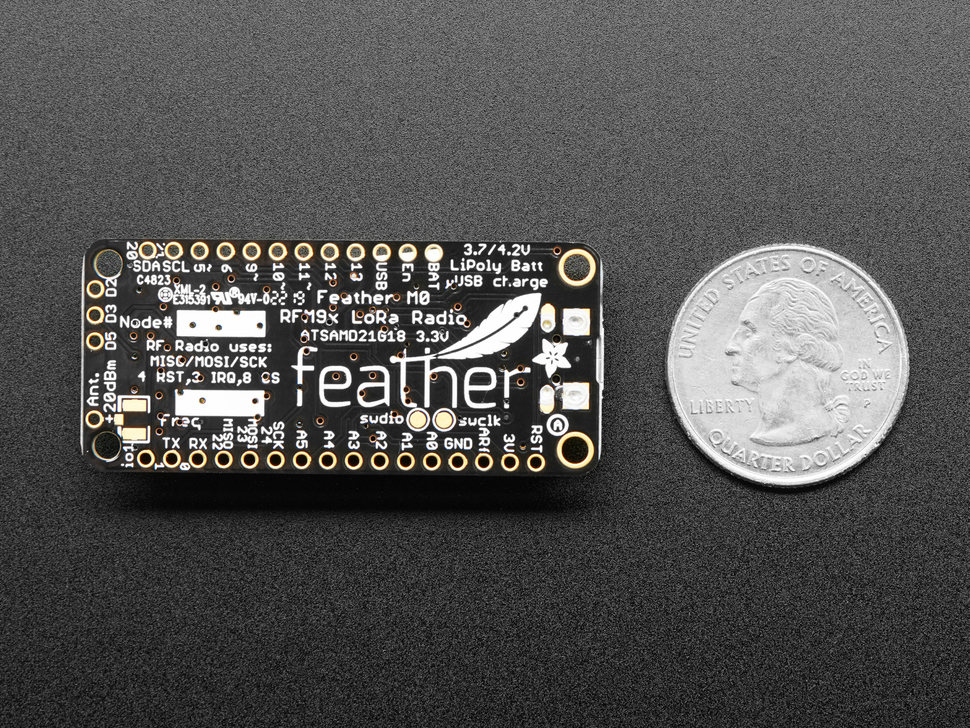
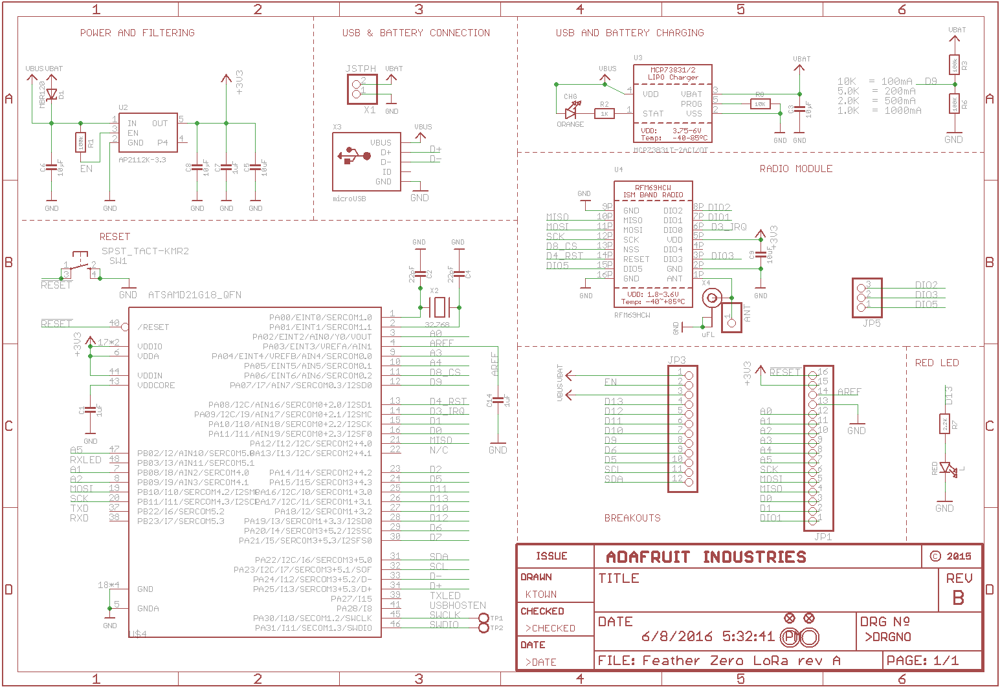
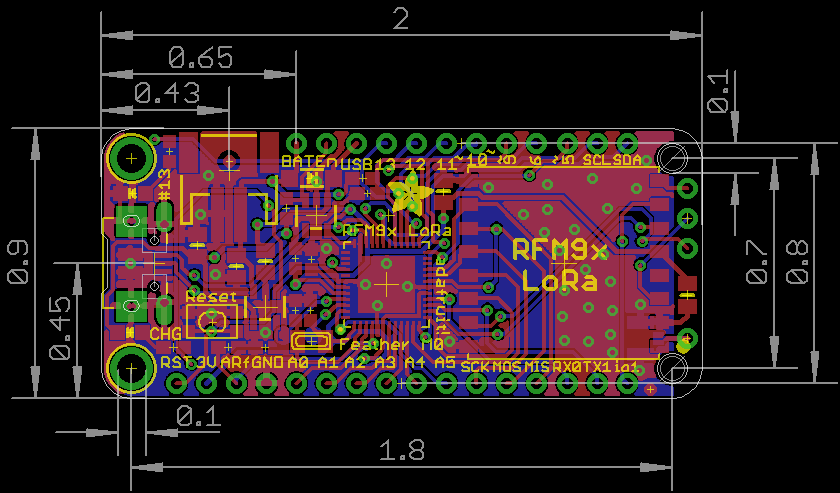

## Propuesta ##

Se propuso realizar una adaptación de la placa Adafruit Feather M0 Radio with LoRa Radio Module.

> <b>NOTA:</b> Más información sobre el trabajo se puede encontrar en las páginas web donde [se encuentra a la venta](https://www.adafruit.com/product/3178) junto con [los datos detallada de la misma](https://learn.adafruit.com/adafruit-feather-m0-radio-with-lora-radio-module/downloads).

     
    <b>Figura 1</b>. Vista superior de la placa. 

     
    <b>Figura 2</b>. Vista inferior de la placa. 

     
    <b>Figura 3</b>. Diagrama esquemático. 

     
    <b>Figura 4</b>. Circuito impreso. 

